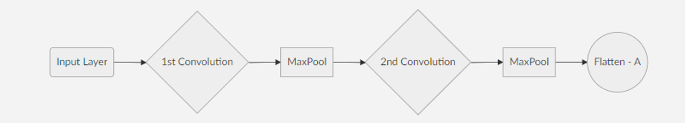
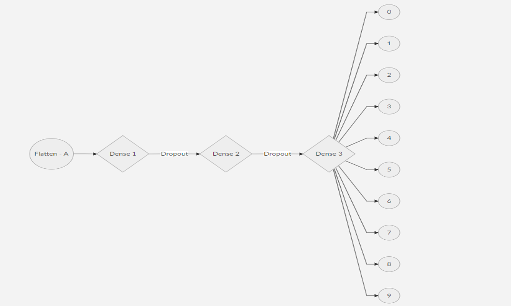
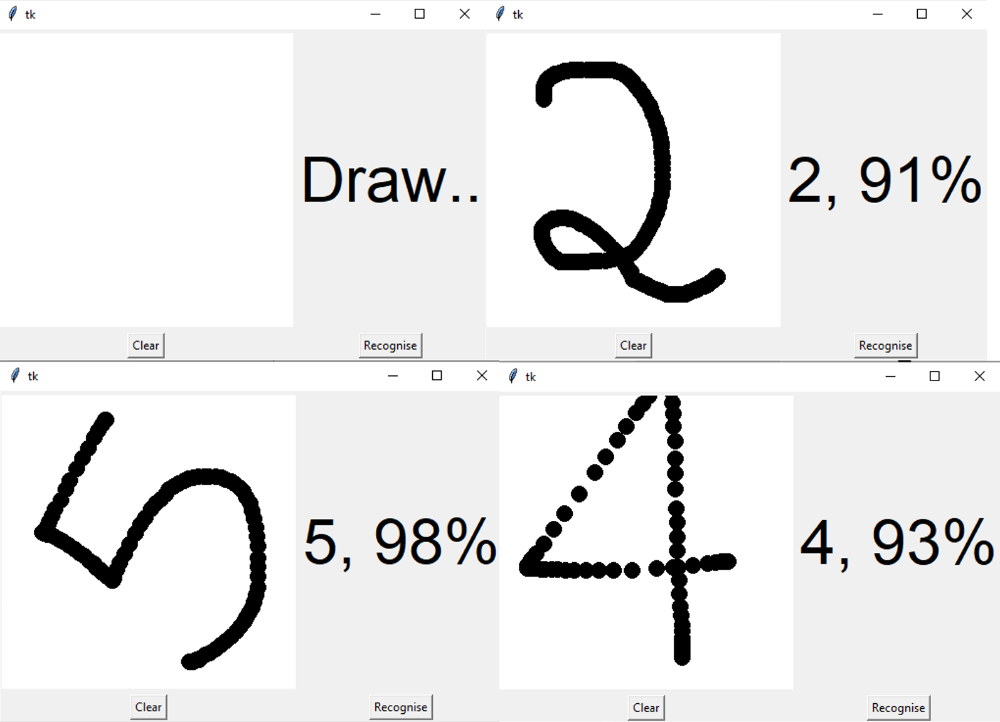


# Hand Written Digit Recognizer 

Hand written digit recognizer using **Python 3.8**. 
GUI based **drawable console**. 


# Files
The repository contains 3 files. 
1. train_model.py : Python code file for training the neural network.
2. gui_console.py : Python code for creating the GUI console aand predicting inputs.
3. mnist.h5 : Pretrained weights file in hdf5 file formart

## Libraries
1. Keras
```
pip install Keras : Windows 
sudo pip3 install keras : Linux
```
2. Tkinter
```
pip install python-tk : Windows
sudo apt-get install python3-tk : Linux
```
3. Numpy
```
pip install numpy : Windows
sudo apt install python-numpy : Linux 
```
Other Libraries
```
PIL, win32gui
```

## Neural Network Architecture




## GUI Console


## System Working
The model uses mnist dataset which contains 60000 handwritten digit images. Before feeding the nueral newtwork with the images, they are pre-processed. Several convolutional layers and pooling layers are applied and the output of the 2nd max pooling layer is flattened to feed the neural network input nodes. 
The dense layers are the main layers of the neural network which are followed by a dropout value to prevent the model from over fitting. 10 epochs gives an average accuracy of 0.9981. 
Trained weights are stored in a file named mnist.h5.
>Note: The provided file is a pretrained file. It is recommended to retrain the entire model with >=8 epochs to increase accuracy of the system.
Make sure if you are testing it then update the file location accordingly

The GUI console is developed using the tkinter library. Input is a drawable white screen where the user can draw the numbers and check for the prediction.
>Note: If you are using Jupyter Notebook, the console will not pop on the screen. You will find the running file on the taskbar of your operating system.
